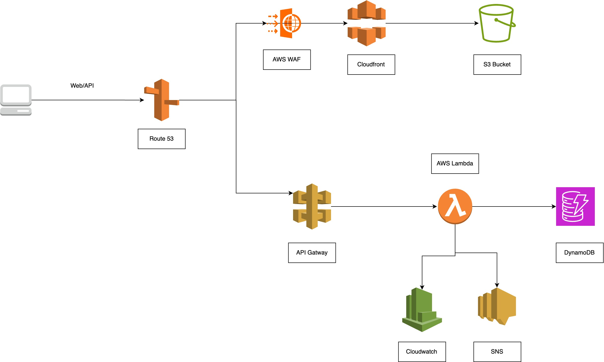

# URLkit

[](LICENSE)

URLkit is an enterprise-grade URL shortening service built on AWS serverless architecture. It provides highly available, secure, and scalable URL shortening capabilities with comprehensive monitoring and analytics.

[Documentation](https://docs.urlkit.io) | [API Reference](https://api.urlkit.io/docs) | [Contributing](CONTRIBUTING.md)

## Key Features

### High Performance & Scalability
- Sub-100ms response times globally
- Horizontally scalable architecture handling millions of requests
- Multi-region deployment support
- Automated scaling with no cold starts
- Built-in request caching and optimization

### Enterprise Security
- AWS WAF integration with customizable rules
- DDoS protection and rate limiting
- Comprehensive input validation
- Malicious URL detection
- IP-based access control
- Domain allowlisting capabilities
- SSL/TLS enforcement with custom certificates

### Reliability & Monitoring
- 99.99% availability SLA
- Real-time monitoring and alerting
- Detailed error tracking and logging
- Custom CloudWatch metrics and dashboards
- Automated backup and recovery
- Cross-region failover support

### Developer Features
- RESTful API with comprehensive documentation
- Multiple SDK support (Python, JavaScript, Java)
- Webhook integration capabilities
- Custom domain support
- Bulk URL processing
- Detailed analytics and reporting

## Architecture

URLkit leverages modern AWS serverless technologies:

### Core Components
- Frontend: React with TypeScript
- Backend: AWS Lambda (Python 3.12)
- Database: Amazon DynamoDB
- CDN: CloudFront with Lambda@Edge
- Security: AWS WAF, ACM, Custom Security Headers
- Monitoring: CloudWatch, SNS Alerts

### Infrastructure
- Infrastructure as Code using AWS CDK
- Automated CI/CD pipeline
- Multi-environment support (dev, staging, prod)
- Blue-green deployment capability
- Automated testing and validation

## Quick Start

### Prerequisites
- Node.js >= 18
- AWS CDK >= 2.0
- Python >= 3.12
- AWS CLI with appropriate permissions

### Installation

1. Clone and setup:
```bash
git clone https://github.com/shubhamtyagi098/urlkit.git
cd urlkit
npm install
```

2. Deploy infrastructure:
```bash
cdk deploy
```

## API Reference

### Create Short URL
```http
POST /urls
Content-Type: application/json

{
    "url": "https://example.com/path",
    "expires_in_days": 30,
    "user_id": "user123"
}
```

### Response
```json
{
    "short_url": "https://urlkit.io/abc123",
    "original_url": "https://example.com/path",
    "expiration_date": "2024-12-28T10:00:00Z",
    "status": "active"
}
```

## Architecture



URLkit uses a serverless architecture leveraging AWS services for high availability and scalability. The system comprises:

- Global CDN with CloudFront for fast content delivery
- WAF protection against common web vulnerabilities
- Serverless compute with Lambda for automatic scaling
- DynamoDB for consistent sub-10ms data access
- Comprehensive monitoring via CloudWatch

## Security Features

### URL Validation
- Protocol enforcement (HTTPS/HTTP)
- Domain validation and blocking
- Private IP protection
- Path traversal prevention
- XSS and injection protection

### Access Control
- Rate limiting per IP/User
- Geographic restrictions
- Custom allow/deny lists
- Token-based authentication
- CORS configuration

## Monitoring & Observability

### Real-time Metrics
- Request volume and latency
- Error rates and types
- Cache hit ratios
- Resource utilization
- Security events

### Alerting
- Anomaly detection
- Error rate thresholds
- Resource utilization alerts
- Security incident notifications
- Custom metric alarms

## License

URLkit is licensed under the MIT License. See [LICENSE](LICENSE) for details.

## Support

For enterprise support and custom deployments, contact [enterprise@urlkit.io](mailto:enterprise@urlkit.io).